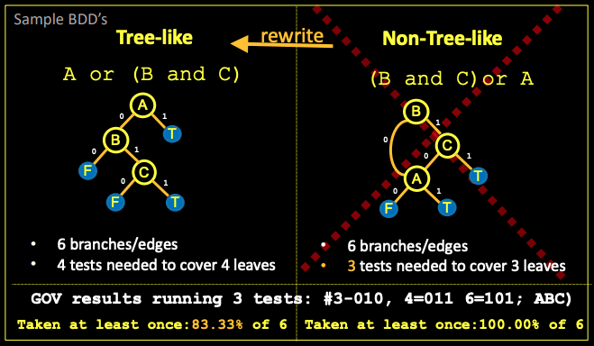

# MCDC Checker의 효용성 조사

## 배경

`gcov`로 커버리지를 확인할 때 decision(e.g. `if`문)의 형태에 따라 실제로는 MC/DC 100%를 달성하지 못함에도 달성하는 것으로 표시될 때가 있다.

코드 내에 트리 형태로 표현될 수 없는 decision이 존재할 시 이러한 문제가 나타난다.

`mcdc-checker`는 이러한 decision을 감지하고, condition들을 어떻게 재배치하면 decision이 트리 형태로 표현될 수 있는지 제시할 수 있다.

### MC/DC 개요

[What Is A Unit Test and How To Use gcov to do MC/DC unit testing?](https://www.youtube.com/watch?v=k0_PF8MtEEo)

## 예제

아래의 함수를 테스트하는 상황을 가정한다.

```c
#include <stdbool.h>

int abort_mission_non_treelike(
        int off_course,
        int abort_command,
        int com_stat_ok)
{
    int result;

    result = false;
    if ((abort_command && com_stat_ok) || off_course)
        result = true;
    else
        result = false;
    return (result);
}
```

이 상황에서 중요한 점은 `if ((abort_command && com_stat_ok) || off_course)` 내부의 condition (`abort_command`, `com_stat_ok`, `off_course`)에 다양한 값을 입력해보는 것이다. 이때 `gcov`를 사용해 테스트 케이스들이 이 함수를 얼마나 커버하고 있는지 확인할 수 있다.

이 함수의 경우 다음 8개의 입/출력 경우의 수가 존재하는데,

| Test Case # | off_course | abort_command | com_stat_ok | return |
|-------------|------------|---------------|-------------|--------|
|1            |           0|              0|            0|       0|
|2            |           0|              0|            1|       0|
|3            |           0|              1|            0|       0|
|4            |           0|              1|            1|       1|
|5            |           1|              0|            0|       1|
|6            |           1|              0|            1|       1|
|7            |           1|              1|            0|       1|
|8            |           1|              1|            1|       1|

MC/DC를 달성하기 위해서는 최소한 2, 3, 4, 6번 케이스를 테스트해야 한다.

하지만 decision 내부의 condition의 순서에 따라 `gcov`의 보고 결과가 달라질 수 있다. 위 함수에 대해 다음의 테스트를 수행했을 때:

```c
// 2번 케이스는 검사하지 않음
abort_mission_non_treelike(false, true, false); // 3번 케이스
abort_mission_non_treelike(false, true, true);  // 4번 케이스
abort_mission_non_treelike(true, false, true);  // 6번 케이스
```

MC/DC를 달성하지 못한다. 하지만 위 함수를 `gcov -b` 옵션을 통해 검사했을 시

```
Lines executed:100.00% of 6
File 'abort_mission_non_treelike.c'
Lines executed:100.00% of 6
Branches executed:100.00% of 6
Taken at least once:100.00% of 6
No calls
Creating 'abort_mission_non_treelike.c.gcov'
```

```
function abort_mission_non_treelike called 3 returned 100% blocks executed 100%
        3:    3:int abort_mission_non_treelike(
        -:    4:        int off_course,
        -:    5:        int abort_command,
        -:    6:        int com_stat_ok)
        -:    7:{
        -:    8:    int result;
        -:    9:
        3:   10:    result = false;
        3:   11:    if ((abort_command && com_stat_ok) || off_course)
branch  0 taken 67% (fallthrough)
branch  1 taken 33%
branch  2 taken 50% (fallthrough)
branch  3 taken 50%
branch  4 taken 50% (fallthrough)
branch  5 taken 50%
        2:   12:        result = true;
        -:   13:    else
        1:   14:        result = false;
        3:   15:    return (result);
        -:   16:}
```

위와 같이 100%의 커버리지를 기록한 것으로 판단하게 된다. 이 문제는 위 decision `if ((abort_command && com_stat_ok) || off_course)`을 트리 형태로 나타낼 수 없기 때문에 발생한다.



위 decision은 위 이미지에서 우측 상태에 해당한다. 이는 `mcdc-checker`를 사용하여 감지할 수 있다. 예제 소스 코드를 해당 툴에 입력한 결과는:

```
Processing file /code/abort_mission_non_treelike.c
  Non tree-like decision in file /code/abort_mission_non_treelike.c at line 11, column 9

Statistics (including decisions encountered multiple times, e.g. in included headers):
  Number of decisions: 1
  Number of tree-like decisions: 0
  Number of correctable tree-like decisions: 1
  Number of non-correctable tree-like decisions: 0
  Number of compiler preprocess/parse errors: 0
  Number of files checked: 1

The following errors were found (excluding decisions encountered multiple times, e.g. in headers):
  BDD is not tree-like for the following decisions:
    file /code/abort_mission_non_treelike.c in line 11 column 9
      Found solution: off_course, abort_command, com_stat_ok
```

위 결과에서 볼 수 있듯이 이 코드에는 "correctable tree-like decisions"가 존재하며, 이는 condition의 순서를 `off_course`, `abort_command`, `com_stat_ok`로 변경함으로서 해결할 수 있다.

하여 다음과 같이 함수를 수정한 결과:

```c
#include <stdbool.h>

int abort_mission_treelike(
        int off_course,
        int abort_command,
        int com_stat_ok)
{
    int result;

    result = false;
    if (off_course || (abort_command && com_stat_ok))
        result = true;
    else
        result = false;
    return (result);
}
```

같은 조건으로 `gcov -b`를 실행하면:

```
File 'abort_mission_treelike.c'
Lines executed:100.00% of 6
Branches executed:100.00% of 6
Taken at least once:83.33% of 6
No calls
Creating 'abort_mission_treelike.c.gcov'
```

전체 브랜치 중 83.33%만이 커버되었음을 감지하고

```
function abort_mission_treelike called 3 returned 100% blocks executed 100%
        3:    3:int abort_mission_treelike(
        -:    4:        int off_course,
        -:    5:        int abort_command,
        -:    6:        int com_stat_ok)
        -:    7:{
        -:    8:    int result;
        -:    9:
        3:   10:    result = false;
        3:   11:    if (off_course || (abort_command && com_stat_ok))
branch  0 taken 67% (fallthrough)
branch  1 taken 33%
branch  2 taken 100% (fallthrough)
branch  3 taken 0%
branch  4 taken 50% (fallthrough)
branch  5 taken 50%
        2:   12:        result = true;
        -:   13:    else
        1:   14:        result = false;
        3:   15:    return (result);
        -:   16:}
```

`*.gcov` 파일을 열어 3번 브랜치가 커버되지 않았음을 파악할 수 있다.

## 결론

`mcdc-checker`를 사용해 소스 코드를 정적 분석함으로서 `gcov`가 잘못된 결과를 출력하도록 하는 "트리 형태가 아닌 decision" 구문을 감지하고, 이를 올바르게 수정할 수 있다.

## 설치법

- `mcdc-checker` docs: https://gtd-gmbh.gitlab.io/mcdc-checker/mcdc-checker/usage/installation.html
- `mcdc-checker` repo: https://gitlab.com/gtd-gmbh/mcdc-checker/mcdc-checker/-/tree/master?ref_type=heads

공식 문서에서의 설치법은 도커 이미지를 pull하는 방식이지만 이는 알 수 없는 이유(방화벽 문제로 추정)로 동작하지 않는다. 때문에 저장소를 로컬에 클론 후 해당 디렉토리에서 도커 이미지를 빌드해야 한다.

해당 저장소를 클론하기 전 다음 단계를 수행해야 한다.

1. GitLab 서버와 통신할 때 발생하는 server certificate verification failed 오류를 해결한다.
    - `git config --global http.sslVerify false`
1. Git LFS를 설치한다.
    - `curl -s https://packagecloud.io/install/repositories/github/git-lfs/script.deb.sh | sudo bash`
    - `sudo apt-get install git-lfs`
1. 저장소 내의 서브모듈까지 포함하여 `git clone`한다.
    - `git clone https://gitlab.com/gtd-gmbh/mcdc-checker/mcdc-checker.git --recurse-submodule`

위 디렉토리로 진입한 뒤 `sudo docker build .`를 실행하여 도커 이미지를 빌드한다.
빌드한 이미지의 ID를 `sudo docker image ls`로 확인할 수 있다.

> `docker pull`을 통해 이미지를 받지 않았기 때문에 REPOSITORY 또는 TAG값이 없어 IMAGE ID를 통해 이미지를 구분해야 한다.

## 사용법

```bash
sudo docker run -it -v $PWD:/code $MCDC_CHECKER_ID $FILENAME
```

- `-v $PWD:/code`: 현재 디렉토리를 도커 컨테이너의 `/code`에 마운트한다.
    - 이는 현재 디렉토리에 있는 모든 파일에 (특히 `*.h` 파일) 도커 컨테이너가 접근할 수 있도록 하기 위함이다. 따라서 아래의 `$FILENAME` 또한 호스트 머신 기준의 경로가 아닌 `/code` 볼륨 기준 경로로 기입해야 한다.
- `$MCDC_CHECKER_ID`: 위 단계에서 확인한 이미지의 ID를 기입한다.
- `$FILENAME`: 검사하고자 하는 파일의 경로를 기입한다.

### 여러 파일을 검사하고자 할 때

공식 문서에서는 `$FILENAME`에 `-`를 입력할 시 표준 입력에서 파일의 리스트를 받아온다고 되어 있지만 이는 docker 컨테이너에서 구동할 시 잘 작동하지 않는다. 대신 아래의 Makefile 구문을 통해 여러 파일을 검사할 수 있다.

```Makefile
mcdc_check:
	for c_filename in $(SRCS) ; do \
		sudo docker run -it -v $(PWD):/code $(MCDC_CHECKER_ID) /code/$$c_filename ; \
	done
```

간단한 for 구문으로 공백으로 구분된 파일 목록을 검사한다.
